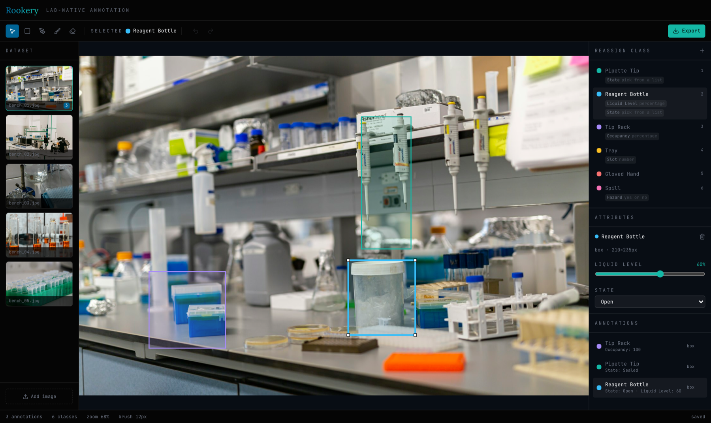
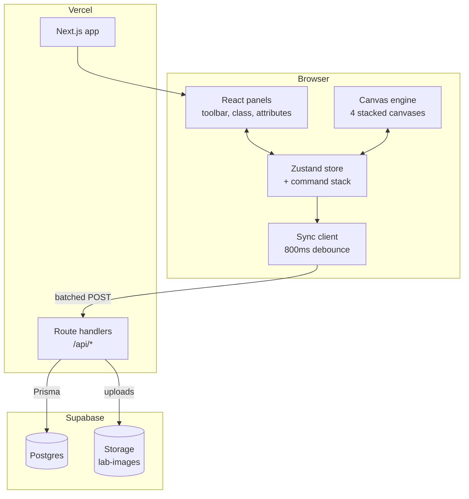
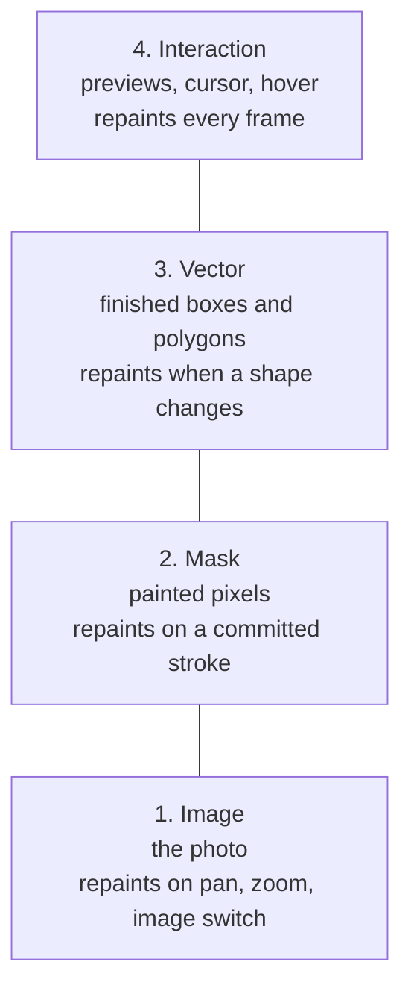
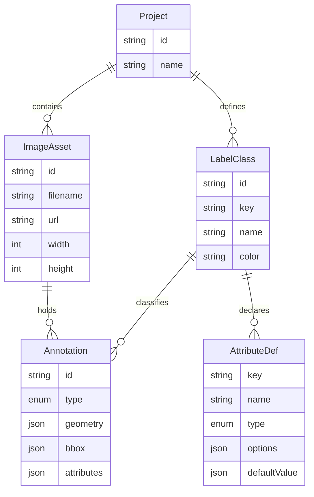
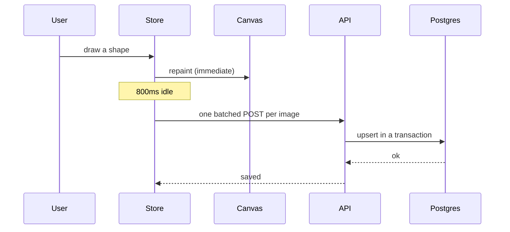

# Rookery

Browser-based image annotation for computer vision and dataset preparation,
built for lab imagery.

Open a photo of a lab bench, trace the objects in it, tag each one with a class,
record its state, and export a structured JSON dataset.

**[Live demo](https://rookery-seven.vercel.app)** &nbsp;·&nbsp;
**[Video: the tool](https://www.loom.com/share/1deafa587f4844478a25b91c6117d586)** &nbsp;·&nbsp;
**[Video: architecture](https://www.loom.com/share/55f8d405db55438eb0f536945e5cb827)**

[Canvas performance](#canvas-performance) &nbsp;·&nbsp;
[State handling](#state-handling) &nbsp;·&nbsp;
[Data model](#data-model) &nbsp;·&nbsp;
[Running it](#running-it)



---

## Why it exists

Corvinus builds a robot that takes a written protocol and runs it on a real
bench. To do that it has to read the bench. Not only "there is a bottle there",
but "that bottle is open and half full, so I can draw from it".

That reading is learned from labeled examples. This tool produces them.

The per-instance attributes matter as much as the shapes. `Liquid Level: 50%`
and `State: Open` are preconditions. "Draw 200µL from reagent A" only works if A
is open and has liquid in it. Shapes tell the robot where not to collide.
Attributes tell it what it is allowed to do next.

This produces perception and state labels. Action labels come from
teleoperation, which is a separate pipeline.

---

## System architecture



One deploy covers the UI and the API, because the route handlers are files
inside the Next.js app. Supabase hosts the database and the uploaded files.

---

## Canvas performance

### Four stacked canvases

A canvas is one flat surface with no layers of its own. Changing anything means
clearing it and drawing everything again.

So the app uses four canvases, split by how long their contents live.



Say 30 polygons are on the image and you start another one. A line follows your
cursor showing where the next edge will land. If that line lived on the vector
layer, every pointer move would mean clearing it and redrawing all 30 polygons,
60 times a second. That is around 1,800 polygon redraws per second to animate
one line.

On its own layer it is one path on an empty surface, and the 30 finished shapes
are never touched.

The rule: things that change every frame and things that almost never change
should not share a canvas.

A test holds this. It runs 60 frames of dragging and asserts the photo, the mask
and the finished shapes were repainted zero times.

### Other techniques

| Technique | What it does |
|---|---|
| Dirty flag per layer | A layer that did not change is never repainted |
| requestAnimationFrame batching | 50 invalidations in one frame produce 1 repaint |
| getCoalescedEvents | A 120Hz pointer contributes every sample, so fast strokes stay smooth |
| Stroke interpolation | A fast drag paints a solid line instead of a dotted one |
| setTransform for pan and zoom | One matrix, and shape coordinates always stay in image space |
| devicePixelRatio sizing | Crisp lines on retina, while draw code still works in CSS pixels |
| createImageBitmap | Photos decode off the main thread |
| Grid hit testing | A hover test checks shapes near the cursor instead of all of them |
| Cached tinted masks | Converting a 1600x1067 mask to colour is 6.8 MB, so it is cached |

Point data is stored as a flat `Float32Array` instead of arrays of `{x, y}`
objects. One block of memory instead of thousands of tracked objects, so there
is no garbage collection pause partway through a stroke.

### What is deliberately absent

**No canvas library.** Konva or Fabric would have been quicker to build with,
but then the performance decisions belong to the library and cannot be
explained.

**No WebAssembly or WebGL.** Both were considered. At this size the cost is
redundant repaints, which layering and dirty flags already fix. GPU compositing
would be the next step if masks or image counts grew by an order of magnitude.

---

## State handling

### Store

Zustand, with annotations keyed by id in a flat record. Editing one annotation
replaces one entry, so only the things reading that annotation re-render.

A test checks object identity, which is the part that makes this worth doing:
editing annotation B leaves annotation A as the same object in memory.

### React does not drive the canvas

A pointer move that triggered a React render has already missed the frame.

So the canvas subscribes to the store directly and repaints itself. React
renders the panels around it. They share state and do not share a render cycle.

### Undo stores the action

The usual approach is to copy the state after every edit and swap an old copy
back. That is fine for boxes. It fails for masks, where one 4K bitmap is around
33 MB and thirty strokes would exhaust memory.

Each edit is an object that knows how to apply and reverse itself.

| Edit | What it stores |
|---|---|
| Add shape | the shape |
| Move shape | the delta, so undo applies the opposite |
| Change attribute | the old and new value |
| Change class | the old class and its attributes |
| Brush stroke | the cursor path, radius, and mode |

All of them are kilobytes.

### Snapshots make undo constant time

Painting is destructive. Stroke 100 covered whatever was under it and that
information is gone, so undo cannot subtract a stroke. It has to rebuild by
replaying.

Replaying from the start gets slower the longer you work:

| Strokes made | Replays on undo | Freeze |
|---|---|---|
| 50 | 49 | ~100ms |
| 200 | 199 | ~400ms |
| 500 | 499 | ~1s |

The fix is to snapshot the mask every 20 strokes. Undo loads the nearest
snapshot and replays only from there, so it never replays more than 20 strokes
no matter how long the session ran.

| Snapshot every | Memory | Replays | Result |
|---|---|---|---|
| 1 stroke | ~830 MB at 100 strokes | 0 | crashes the tab |
| **20 strokes** | **~10 MB** | **at most 19** | chosen |
| never | ~0 | up to 499 | 1s freeze |

Snapshots are packed at one byte per pixel, so a full-HD snapshot is about 2 MB
and a rolling window of five is about 10 MB.

Drawing forward never replays at all, so painting stays instant either way.

Two tests cover this. One asserts replay stays under 20 after 500 strokes. The
other builds a second buffer with no snapshots at all and checks the pixels come
out identical, which proves the shortcut does not change the result.

---

## Data model



### Classes ask the questions, annotations hold the answers

A class declares an attribute schema:

```
Reagent Bottle
  Liquid Level   percent
  State          enum [Open, Closed]
```

An annotation fills it in:

```
class:      Reagent Bottle
geometry:   polygon around this bottle
attributes: { "Liquid Level": 50, "State": "Open" }
```

The attribute panel has no code that mentions "Liquid Level" or "State". It
reads the class, walks the schema, and picks a control from each entry's type.
Create a class at runtime with a Barcode field and a text input appears with no
code change.

Changing an annotation's class replaces its attributes with the new class's
defaults. A Reagent Bottle's liquid level means nothing on a Gloved Hand, and
keeping it would put keys in the export that the schema never declared. The old
values are kept for undo.

### Geometry

```
box      { "x": 409, "y": 220, "w": 92, "h": 170 }
polygon  { "points": [[412,220], [498,220], [501,390]] }
mask     { "rle": [...], "width": 1600, "height": 1067 }
```

Geometry, bbox and attributes are JSONB columns. Different classes declare
different attributes and three shape types have three structures, which fixed
columns cannot express. JSONB stays queryable, so `attributes->>'State' = 'Open'`
still works.

Masks use run-length encoding. A measured example from this app: a 1600x1067
mask, 1,707,200 pixels, stored as 145 integers.

### Simplification

Brush paths run through Ramer-Douglas-Peucker. The pointer samples on a timer
instead of on curvature, so most points are jitter. A test feeds 200 samples and
checks it reduces to under 10 with no visible change.

Polygon vertices are left alone. A person clicked each one on purpose, and
dropping one because three clicks landed nearly in a line looks like lost work.

---

## Export

```json
{
  "schema_version": "1.0",
  "exported_at": "2026-09-03T19:17:38.869Z",
  "project": { "id": "prj_local", "name": "Lab Bench Dataset" },
  "classes": [{
    "id": "reagent_bottle",
    "name": "Reagent Bottle",
    "color": "#38BDF8",
    "attributes": [
      { "name": "Liquid Level", "type": "percent" },
      { "name": "State", "type": "enum", "options": ["Open", "Closed"] }
    ]
  }],
  "images": [{
    "id": "img_bench_01", "file": "bench_01.jpg", "width": 1600, "height": 1067,
    "annotations": [{
      "id": "...", "class": "reagent_bottle", "type": "box",
      "geometry": { "x": 285, "y": 718, "w": 210, "h": 255 },
      "bbox": [285, 718, 210, 255],
      "attributes": { "Liquid Level": 100, "State": "Closed" }
    }]
  }]
}
```

`buildExport` is a pure function with no database or request awareness, so the
format is tested without a server and the same code serves the download button
and the API route.

Every annotation carries a bbox even when it is a polygon or a mask, because
training pipelines expect one and should not have to decode an RLE to get it.

Images with no annotations are still exported. A dataset needs to tell "reviewed
and empty" apart from "never looked at".

Export order is stable, so two exports of the same state produce identical
bytes. That matters for diffing datasets.

The preview panel renders this JSON with syntax colouring. Class names and text
values are written by users, so the highlighter escapes `&`, `<` and `>` before
wrapping anything in tags. Two tests cover that, using `<script>` as a key and an
`onerror` payload as a value.

---

## Persistence

### The network stays out of the drawing loop

Drawing writes to the store and returns. Nothing waits on a server.



A brush stroke produces dozens of store updates a second. One request each would
be pointless and hard on the database, so changes are batched after 800ms of
idle. Same idea as the canvas layering: keep slow things out of the loop that
has to feel instant.

### Upserts

Annotation ids come from the client, because drawing should not wait on a round
trip to find out what a shape is called. That means the server cannot tell
whether a shape is new, so every write is an upsert. This also makes a retried
request safe: a sync that times out after committing can be sent again without
creating duplicates.

Each flush is one transaction. A dropped connection would otherwise save some
shapes and lose others while the client believed all of them landed.

Classes sync before annotations, because an annotation pointing at an unsaved
class breaks the foreign key.

### One project per browser

There is no login, so a single shared project would let any visitor overwrite
someone else's work. Each browser creates its own project and keeps the id in
localStorage.

The tradeoff: clearing site data loses that project. Accounts would be the
answer if a dataset ever needs to be shared across machines.

### Running with no database is supported

If nothing is configured or the API is unreachable, the app falls back to seeded
in-memory data and says "in-memory only" in the status bar. Every tool, the
class registry and the export still work. Only durability across a refresh is
lost.

A labeling tool that refuses to open because a database is missing is worse than
one that forgets.

### Two connection strings

| Variable | Connection | Used by |
|---|---|---|
| `DATABASE_URL` | pooled, PgBouncer, port 6543 | the running app |
| `DIRECT_URL` | direct or session pooler, port 5432 | migrations only |

Serverless functions open many short connections and Postgres refuses them
without a pooler. But PgBouncer in transaction mode cannot run the session-level
statements a migration needs. Pointing either at the wrong one fails in
confusing ways.

### Prisma 7 notes

Prisma 7 moved connection URLs out of `schema.prisma` into `prisma.config.ts`,
replaced the bundled engine with driver adapters, and stopped loading `.env` in
the CLI. All three are handled and commented where they happen.

Both Prisma packages are pinned to 7.10.0. `npm i prisma` installs a release
candidate, because Prisma publishes those to the `latest` tag.

---

## Tools

| Tool | Key | Use for |
|---|---|---|
| Select | `V` | Click to select, drag to move |
| Box | `B` | Rough location, one drag |
| Polygon | `P` | Rigid labware such as trays, racks, bottles |
| Brush | `D` | Spills, liquid, gloved hands, anything without an outline |
| Erase | `E` | Fix overpaint, cut out things in front |

A box around a diagonal pipette is mostly empty bench, which makes the robot
plan around space that is actually free. And `Liquid Level: 50%` needs the
liquid boundary, which a rectangle cannot express. Hence the finer tools.

Give an annotator only polygons and labeling takes five times as long. Give them
only boxes and the data is too coarse to plan a grasp.

### Keyboard

```
V B P D E     select, box, polygon, brush, erase
1-9           pick a class, or reassign the selected shape
[ ]           brush size
space + drag  pan
F or 0        fit image to view
Cmd/Ctrl+Z    undo         Cmd/Ctrl+Shift+Z   redo
Enter         close polygon       Backspace    remove last vertex
Delete        delete selected     Escape       cancel or close
```

---

## Running it

```bash
npm install
npm run dev
```

Open http://localhost:3000. Four lab bench photos are bundled, so there is
something to annotate right away.

```bash
npm test              # 146 tests
npx tsc --noEmit      # typecheck
npx eslint .          # lint
```

### With persistence

Create a Supabase project, then:

```bash
cp .env.example .env      # fill in DATABASE_URL and DIRECT_URL
npx prisma migrate dev --name init
npm run dev
```

Annotations now survive a refresh and the status bar reads "saved".

Image upload additionally needs Supabase Storage with a public `lab-images`
bucket. The bundled photos work without it.

---

## Testing

146 tests across 14 suites.

| Area | Tests |
|---|---|
| Mask buffer and snapshots | 22 |
| Geometry | 17 |
| Store | 13 |
| Export builder | 12 |
| Command stack | 10 |
| Annotation commands | 10 |
| Storage serialization | 10 |
| Renderer dirty flags | 9 |
| Run-length encoding | 9 |
| Viewport transform | 8 |
| Hit testing | 8 |
| Store to export mapping | 7 |
| Path simplification | 6 |
| JSON highlighter escaping | 5 |

Pure logic is tested properly, since that is where bugs hide and a test costs
less than checking by hand. Canvas rendering and React panels are checked by
looking at them.

That second part came from experience during this build. Twice a hand-written
pixel-sampling check reported a failure that turned out to be a stale
`getImageData` readback rather than a real bug. A screenshot settled both in
seconds.

---

## Stack

| Layer | Choice |
|---|---|
| Framework | Next.js 16, App Router, TypeScript |
| Styling | Tailwind v4, theme tokens taken from corvinuslabs.io |
| Fonts | Lora and JetBrains Mono, same as the Corvinus site |
| Icons | Lucide |
| State | Zustand plus a hand-written command stack |
| Canvas | Hand-rolled Canvas2D, four layers |
| Database | Prisma 7 with the pg driver adapter, Supabase Postgres |
| Files | Supabase Storage |
| Tests | Vitest |

---

## Layout

```
app/
  api/               project, sync, class, upload, and export routes
  page.tsx           the workspace
components/
  canvas/            canvas mount, render loop, pointer routing
  panels/            toolbar, image rail, class panel, attributes, export drawer
lib/
  canvas/            geometry, transform, hit testing, RLE, mask buffer, renderer
    layers/          one draw function per layer
    tools/           one file per tool
  state/             store, command stack, undoable edits, sync, bootstrap
  db/                Prisma client, wire serialization, request validation
  export/            export builder, store mapping, JSON highlighter
prisma/              schema and migrations
public/samples/      bundled lab photos, Unsplash License
```

---

## Not built

| | Why |
|---|---|
| Authentication | Not what the brief asks for, and it would cost a day |
| Model-assisted pre-labeling | The obvious next feature. The app is already shaped for it, since a predicted shape and a drawn shape are the same record. It is also how the human's share of the work shrinks over time |
| COCO and YOLO export | The RLE and bbox conventions were picked to make these a mapping layer instead of a rewrite |
| Moving a mask | Mask pixels are fixed at absolute positions, so moving one means re-rasterizing and re-encoding. The code refuses and says why |

### Known tradeoffs

1. Polygon and brush overlap. Both are in the brief and both are justified, but
   an experienced annotator could work with one fewer tool.
2. Undo history is per session. Stroke history does not survive a reload, only
   the pixels do.
3. Masks live in JSONB, around 20 to 50 KB each. Past that they would move to
   object storage as PNGs.
4. One project at a time in the UI, though the schema supports many.
